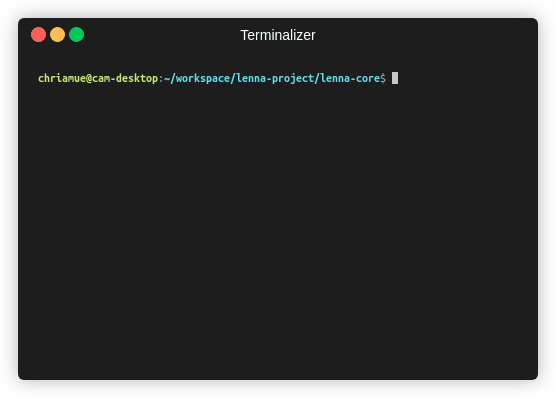

# lenna-core
[](https://github.com/lenna-project/lenna-core/actions)
[](https://crates.io/crates/lenna_core)
[](https://deps.rs/repo/github/lenna-project/lenna-core)

Lenna is a library for image processing algorithms and apps.

This is the core library for lenna.

## quickstart

```sh
cargo build
```

### run tests

```sh
cargo test
cargo test --features=python
wasm-pack test --node
```



## create plugins

```rust
use lenna_core::core::processor::Processor;
use lenna_core::plugins::PluginRegistrar;

lenna_core::export_plugin!(register);

extern "C" fn register(registrar: &mut dyn PluginRegistrar) {
    registrar.add_plugin(Box::new(Plugin));
}

pub struct Plugin;
```

## 🐍 build python bindings

Create a virtual environment for python and install lenna-core using pip.

```bash
virtualenv -p python3 .venv
source .venv/bin/activate
pip install .
python src/plugins/python/test.py
```

```python
import lenna_core_py
print(lenna_core_py.Resize.description())
```


## 🌏 Language Support

|  Rust |  JavaScript |  Python |  C++ |  WASM |
| :---------: | :---------: | :---------: | :---------: | :---------: |
| Yes | Yes | Yes | No | Yes |

## 📜 License

This software is licensed under the [MIT](https://github.com/lenna-project/lenna-core/blob/main/LICENSE) © [lenna-project](https://github.com/lenna-project).
